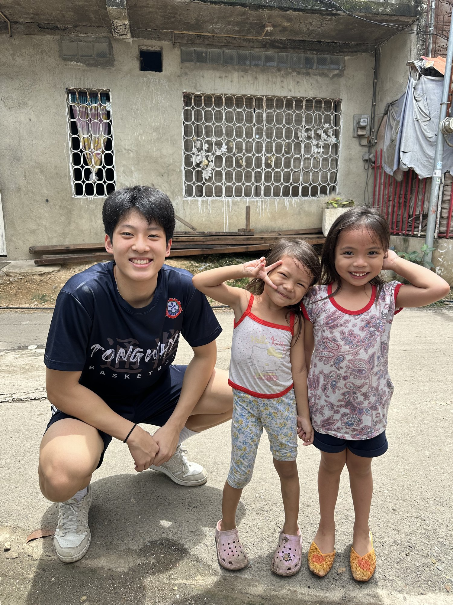

# How to Edit Nathan's Website — Plain-Language Guide

Everything on the site is just files in this GitHub repository. Edit a file →
click **Commit changes** → the live site updates itself in about a minute.
That's the whole system. This guide covers each common task.

---

## The one mental model to remember

- **Text** lives inside the `.html` files.
- **Photos** live in the `images/` folder, and the HTML just points to them by filename.
- **Videos** are not uploaded at all — they live on YouTube/Vimeo and the page embeds them.
- **The paper PDF** is uploaded next to the HTML files and linked by filename.

---

## 1. Editing text (names, paragraphs, titles)

1. In the GitHub repo, click the file (e.g. `index.html`).
2. Click the **pencil icon** (top-right of the file view).
3. Find the text you want to change. Tip: press `Ctrl+F` (Windows) or `Cmd+F`
   (Mac) and search for a phrase you can see on the website — you'll land
   right on it.
4. Edit, then click **Commit changes** (green button). Done — live in ~1 minute.

Anything between `<p>` and `</p>` is a paragraph. Don't delete the angle-bracket
tags themselves; just change the words between them.

---

## 2. Replacing a photo (the easy trick)

The six slideshow photos are named `photo-1.jpg` through `photo-6.jpg` in the
`images/` folder. **If you give a new photo the exact same filename, you don't
have to touch the HTML at all** — it just takes that slot.

1. On your computer, rename the new photo to the slot you're replacing,
   e.g. `photo-2.jpg`. It must be a **JPG** (see section 6 if it's an iPhone
   HEIC photo).
2. In GitHub, open the `images/` folder → **Add file → Upload files**.
3. Drag the new file in and **Commit changes**. GitHub overwrites the old one.

That's it. The slideshow now shows the new photo in that position.

---

## 3. Adding, removing, or reordering slideshow photos

Open `index.html` (pencil icon) and find the block that starts with
`<div class="slideshow"`. Inside it, each photo is one line:

```html

```

- **Reorder:** cut and paste the lines into the order you want.
- **Remove:** delete that photo's line.
- **Add:** upload the new JPG to `images/` (e.g. `photo-7.jpg`), then copy one
  of the lines and change the filename and the `alt` description.
- **One rule:** exactly one image — whichever is *first* — should have
  `class="is-active"`. The others should not have a class at all.

The dots and rotation adjust automatically to however many photos there are.

---

## 4. Adding or changing the documentary video

Videos are embedded from YouTube (or Vimeo), not uploaded.

1. On the YouTube video page, copy the ID — the part after `watch?v=` in the
   address. (`youtube.com/watch?v=abc123` → the ID is `abc123`.)
2. In `index.html`, find `video-placeholder` (Ctrl+F / Cmd+F).
3. Replace the whole placeholder block, from `<div class="video-placeholder">`
   down to its closing `</div>`, with one line:

```html
<iframe src="https://www.youtube.com/embed/abc123" allowfullscreen></iframe>
```

To change the video later, just swap the ID in that line.

---

## 5. Adding the paper PDF and fixing links

**PDF:** Upload the file to the repo's top level (same place as `index.html`),
named simply, e.g. `paper.pdf`. Then anywhere you see `href="#"` on a
"Download the paper (PDF)" button — one on `index.html`, two on `paper.html` —
change it to:

```html
href="paper.pdf" target="_blank"
```

**Links (podcast, LinkedIn, essays, email):** every `href="#"` in the files is
a link waiting to be filled. Replace the `#` with the full web address
including `https://`. The email in the footer: change `hello@example.com` to
the real address.

---

## 6. iPhone photos are HEIC — convert to JPG first

Browsers can't display iPhone HEIC files. Easiest conversions:

- **On iPhone:** Settings → Camera → Formats → "Most Compatible" makes future
  photos JPG. For existing ones, share the photo to Files or email it to
  yourself — iOS usually converts on the way out.
- **On Mac:** open in Preview → File → Export → format JPEG.
- **On Windows:** open in Photos → Save As → JPG.
- **Or:** send them to Claude, who can convert and resize them for you.

Also: big straight-off-the-phone photos make the page slow. Aim for under
~500 KB each (exporting at medium/high quality is fine).

---

## 7. Previewing before you publish

Download the repo files to one folder on your computer (green **Code** button →
**Download ZIP**), keep the structure intact, and double-click `index.html`.
It opens in your browser exactly as it will look live.

---

## Quick reference — where things live

| What | Where |
|---|---|
| Home page text, slideshow, video | `index.html` |
| Paper page (abstract, findings) | `paper.html` |
| Essay list | `writing.html` |
| Colors and fonts (whole site) | `styles.css` |
| Photos | `images/` folder |
| Paper PDF | top level, `paper.pdf` |

If something breaks, don't panic — GitHub keeps every previous version. Open
the file → **History** → pick the version before the change → restore it.
